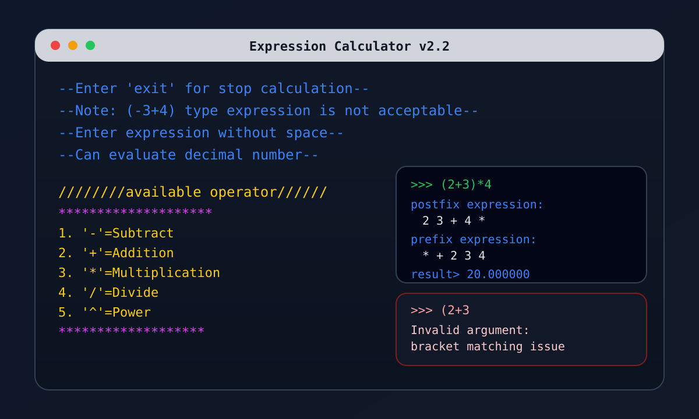

# Expression Calculator

This is a console-based infix expression calculator written in C++. It reads one expression at a time, converts it to postfix notation, and then evaluates the result using custom stack and queue implementations.

This project is updated to version 2.0.

It is also designed for DSA learning. The stack and queue are written manually instead of using STL containers so the expression-handling logic is easier to study, especially the custom stack behavior used during postfix conversion and evaluation.

## Version 2.0 Update

The current version improves the project documentation and reflects the calculator features more clearly.

- Expression evaluation through infix to postfix conversion
- Custom linked-list stack and queue implementations
- Support for decimal numbers
- Support for nested brackets and operator precedence
- Cleaner console output and updated project notes

## Project Files

- [main.cpp](main.cpp) handles the console loop, user prompts, and output.
- [evaluation.hpp](evaluation.hpp) contains expression validation, postfix conversion, and evaluation.
- [stack.hpp](stack.hpp) provides the custom linked-list stack used by the algorithm.
- [queue.hpp](queue.hpp) provides the custom linked-list queue used while parsing numbers.
- [calculator-ui.svg](calculator-ui.svg) is a UI preview image for the calculator screen.

## Project Overview

The calculator accepts a single infix expression at a time, converts it into postfix notation, and evaluates the postfix expression. The program runs continuously until the user types `exit`.

Supported operators:

- Addition: `+`
- Subtraction: `-`
- Multiplication: `*`
- Division: `/`
- Power: `^`

Supported brackets:

- Round brackets: `()`
- Curly brackets: `{}`
- Square brackets: `[]`

## What It Supports

- Operators: `+`, `-`, `*`, `/`, `^`
- Brackets: `()`, `{}`, `[]`
- Decimal numbers such as `3.14`, `2.5`, and `0.001`
- Nested bracketed expressions

The calculator runs continuously until you type `exit`.

## How It Works

1. The program reads an infix expression from the console.
2. [evaluation.hpp](evaluation.hpp) validates the expression for balanced brackets and valid operator placement.
3. The infix expression is converted to postfix notation.
4. The postfix expression is evaluated using a stack of numeric values.
5. The postfix form and final answer are printed to the screen.

The calculator also prints the postfix form before showing the final answer.

## File Description

### [main.cpp](main.cpp)

This file handles the console interface.

- Displays the title and operator list
- Accepts user input
- Prints postfix output
- Prints the final calculated result
- Displays error messages for invalid expressions or runtime errors

### [evaluation.hpp](evaluation.hpp)

This file contains the core logic of the calculator.

- `isValid()` checks bracket matching and expression balance
- `precedence()` returns operator precedence
- `postfix()` converts infix to postfix notation
- `calculate()` applies one operator to two operands
- `evaluate()` computes the final numeric result

### [stack.hpp](stack.hpp)

This file provides the custom linked-list stack implementation.

Main operations:

- `push()` inserts an element on top
- `pop()` removes and returns the top element
- `top()` reads the top element without removing it
- `is_empty()` checks whether the stack is empty
- `display()` prints all elements from top to bottom

### [queue.hpp](queue.hpp)

This file provides the custom linked-list queue implementation.

Main operations:

- `equeue()` inserts an element at the rear
- `dequeue()` removes and returns the front element

The queue is used while building and evaluating multi-digit numbers.

## Input Rules

Enter the expression without spaces.

Examples:

```text
12+3
(5+7)*2
10/[2+3]
2^3^2
3.5*2
```

## Limitations

- Spaces are not supported in the input expression.
- Unary operators such as `-5` are not supported.
- Invalid bracket order, invalid symbols, or malformed numbers will trigger an error.
- Division by zero is detected and reported.

## Runtime Error Handling

The calculator handles runtime errors during execution and shows a clear message when something goes wrong. This includes cases like invalid input, broken expression structure, or division by zero, so the program can keep running and accept the next expression after an error.

## Example Run

```text
>>> (2+3)*4
postfix expression: 2 3 + 4 *
result> 20.000000
```

## UI Screenshot



## Build and Run

Compile the program with your C++ compiler. For example, on Windows with MinGW:

```bash
g++ main.cpp -o calculator
```

Then run the executable and enter an expression when prompted.

## Notes

- The custom stack and queue are implemented with linked lists.
- The postfix conversion and evaluation are done manually for learning purposes.
- The program is useful for studying expression parsing, custom stack behavior, and queue behavior in one workflow.
